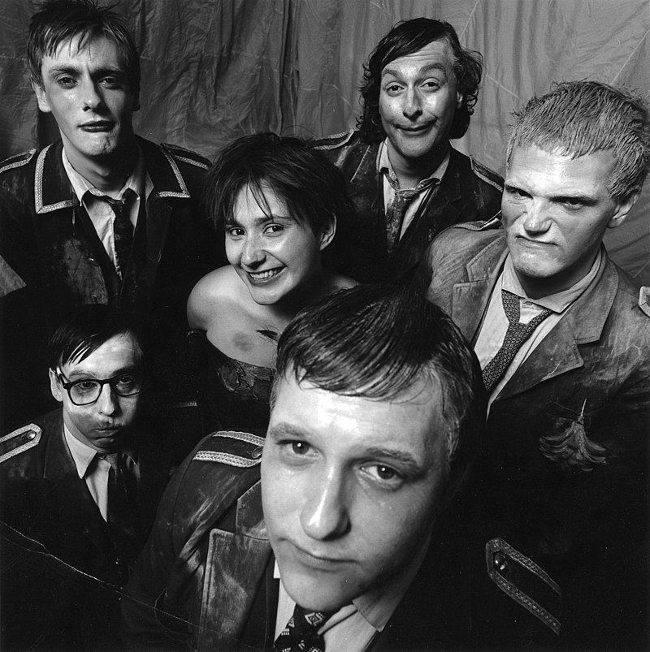

<!--        https://andreuet.w3spaces.com -->

<!DOCTYPE html>
<html lang="es">

<head>
    <meta charset="UTF-8">
    <meta name="viewport" content="width=device-width, initial-scale=1.0">
    <title>Is Punk Rock still alive?</title>
    <link rel="stylesheet" href="hojaestilos.css">
</head>
        <!--
        Aunque yo use la codificación UTF-8 para la representación de mi texto, puede que en algún proceso:

        - Otra persona interviene en la creación de la página y emplea codificación 88509-1
        - El servidor web guarda las páginas HTML estáticas
        - El cliente web del usuario no representa igual las páginas....

        Para la representación del texto uso una herramienta online para convertir el texto simple a
        codificación html (www.textfixeres.com/html/texto-a-html.php)
        -->
<body class="container">
    <header>
        <h1>Punk Prog Blog</h1>
        <h2>Explorando los rincones menos habituales del g&eacute;nero</h2>
    </header>
    <article>
        <header>
            <h3>Cardiacs</h3>
            <h4>Esos grandes y &uacute;nicos</h4>
            

                
<small>Autor</small>

                
<small>Andreu Garcia Coll</small>

            

        </header>
        <h5>Introducci&oacute;n</h5>
        

            Hay m&uacute;sicos que jam&aacute;s logran ser muy conocidos ni mucho menos famosos, pero que sin embargo construyen una devoci&oacute;n y un culto alrededor de su figura y su obra. El ingl&eacute;s Tim Smith es uno de esos personajes que sin propon&eacute;rselo hizo que creciera una subcultura relacionada con su obra y la forma de llevarla. Obviamente, eso solo suele ocurrir con personajes que no encajan en estereotipos. Como &eacute;l bien dec&iacute;a: <q>Si todos estamos cambiando constantemente, ¿por qué iba a perder el tiempo en conocerme?</q> 
            La muerte de Tim deja un inmenso vac&iacute;o.
        

        

        <h5>Origen</h5>
        

            Tim form&oacute; junto a su hermano Jim Smith el embri&oacute;n en 1977 que deriv&oacute; primero en Cardiac Arrest en 1978 y finalmente en Cardiacs en 1981. Quiz&aacute; haya sido el &uacute;nico m&uacute;sico reci&eacute;n llegado en plena vor&aacute;gine punk que se atrevi&oacute; a mezclar el desenfado punk, la parodia, la pantomima surrealista con herencia de los Monty Python y la complejidad del rock progresivo, denostado por aquella generaci&oacute;n.
        

        <a href="https://www.cardiacs.net/" target="_blank" rel="noopener">The home of CARDIACS on the World Wide Web</a>  
         
        <figure>
            
            <figcaption>Foto de la banda</figcaption>
        </figure>
    </article>
    <h5>Formulario de suscripción</h5>
    <form>
            <label for="nombre">Nombre:</label> 
            <input type="text" id="nombre" name="nombre" value="aNDREUET"> 
            <label for="email">e-mail:</label> 
            <input type="email" id="email" name="email" value="noname@noname.es">  
            <label for="msg">Mensaje:</label> 
            <textarea id="msg" name="mensaje_usuario"></textarea> 
            <input type="submit" value="Aceptar">
    </form>
    
Si clicas en el botón de Aceptar, el formulario no irá a ningún lado!!!!!

    

        
    

    

        
    

    

        
    

    <footer>
        <small>El texto est&aacute; disponible bajo <a href="https://creativecommons.org/licenses/by-sa/3.0/legalcode" target="_blank" rel="noopener">la Licencia Creative Commons Atribuci&oacute;n Compartir Igual 3.0</a></small>
    </footer>
</body>

</html>
